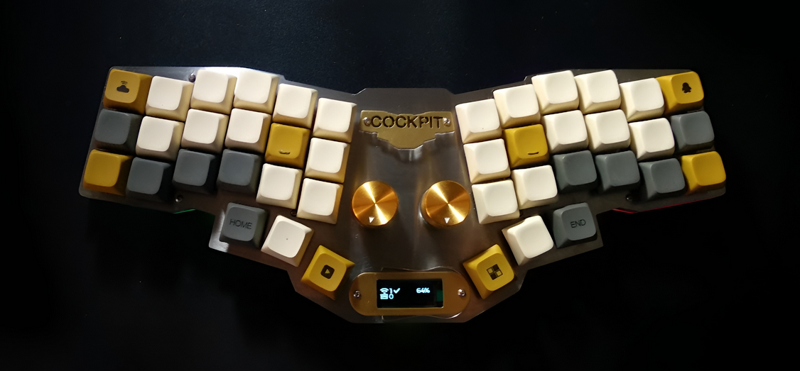

# Cockpit BLE, Reviung41 and Plonck Keymaps 

## Cockpit BLE




```
Keyboard: Cockpit BLE
Default Layer: Colemak
Keyboard Firmware: ZMK
Microcontroller: Nordic nRF52840

Input Language (PC)
(the default layout for given language)
Layout Display Name: Turkish Q
Layout Text: Turkish Q
```

### Colemak Layer (default)
```
                     ╭──────╮                                                ╭──────╮
              ╭──────┤  F   ├──────╮                                  ╭──────┤  U   ├──────╮
╭──────┬──────┤  W   ├──────┤  P   ├──────╮                    ╭──────┤  L   ├──────┤  Y   ├──────┬──────╮
│  ESC │  Q   ├──────┤  S   ├──────┤  G   │                    │  J   ├──────┤  E   ├──────┤  ;   │ BSPC │
├──────┼──────┤  R   ├──────┤NAV T ├──────┤                    ├──────┤  N   ├──────┤  I   ├──────┼──────┤
│ CTRL │  A   ├──────┤SFT C ├──────┤  D   │    ╭(ENCODERS)╮    │  H   ├──────┤SFT , ├──────┤   O  │   '  │
├──────┼──────┤CTR X ├──────┤  V   ├──────┤ ╭──────╮  ╭──────╮ ├──────┤  M   ├──────┤CTL . ├──────┼──────┤
│SFT_CL│ALT Z ├──────╯      ╰──────┤  B   │ │PAUSE │  │ MUTE │ │  K   ├──────╯      ╰──────┤ALT / │  ENT │
╰──────┴──────╯         ╭──────╮   ╰──────╯ ╰──────╯  ╰──────╯ ╰──────╯   ╭──────╮         ╰──────┴──────╯
                        │ ALT  │╭──────╮                          ╭──────╮│ WIN  │
                        ╰──────╯│LOWER │ ╭──────╮        ╭──────╮ │RAISE │╰──────╯
                                ╰──────╯ │SPACE │        │SPACE │ ╰──────╯
                        LOWER TAB <╯     ╰──────╯        ╰──────╯
                    SPACE_LAYER_LEFT SPACE <╯                ╰>SPACE_LAYER_RIGHT SPACE
```


#### Lower Layer
```
                     ╭──────╮                                                ╭──────╮
              ╭──────┤      ├──────╮                                  ╭──────┤   =  ├──────╮
╭──────┬──────┤      ├──────┤      ├──────╮                    ╭──────┤   )  ├──────┤   &  ├──────┬──────╮
│      │      ├──────┤      ├──────┤      │                    │  (   ├──────┤   _  ├──────┤   |  │ DEL  │
├──────┼──────┤      ├──────┤      ├──────┤                    ├──────┤   }  ├──────┤   $  ├──────┼──────┤
│      │      ├──────┤      ├──────┤      │                    │  {   ├──────┤  <   ├──────┤   #  │  "   │
├──────┼──────┤      ├──────┤      ├──────┤ ╭──────╮  ╭──────╮ ├──────┤   ]  ├──────┤   >  ├──────┼──────┤
│      │      ├──────╯      ╰──────┤      │ │ PREV │  │ NEXT │ │  [   ├──────╯      ╰──────┤   \  │ ENT  │
╰──────┴──────╯         ╭──────╮   ╰──────╯ ╰──────╯  ╰──────╯ ╰──────╯   ╭──────╮         ╰──────┴──────╯
                        │ ALT  │╭──────╮                          ╭──────╮│ WIN  │
                        ╰──────╯│LOWER │ ╭──────╮        ╭──────╮ │RAISE │╰──────╯
                                ╰──────╯ │SPACE │        │ENTER │ ╰──────╯
                                         ╰──────╯        ╰──────╯
```


#### Raise Layer
```

                     ╭──────╮                                                ╭──────╮
              ╭──────┤  2   ├──────╮                                  ╭──────┤  F3  ├──────╮
╭──────┬──────┤   1  ├──────┤  3   ├──────╮                    ╭──────┤  F2  ├──────┤  F4  ├──────┬──────╮
│      │  /   ├──────┤  5   ├──────┤  -   │                    │  F1  ├──────┤  F7  ├──────┤      │      │
├──────┼──────┤   4  ├──────┤  6   ├──────┤                    ├──────┤  F6  ├──────┤  F8  ├──────┼──────┤
│      │  *   ├──────┤  8   ├──────┤  +   │                    │  F5  ├──────┤  F11 ├──────┤      │      │
├──────┼──────┤   7  ├──────┤  9   ├──────┤ ╭──────╮  ╭──────╮ ├──────┤  F10 ├──────┤  F12 ├──────┼──────┤
│      │  %   ├──────╯      ╰──────┤  0   │ │      │  │      │ │  F9  ├──────╯      ╰──────┤      │      │
╰──────┴──────╯         ╭──────╮   ╰──────╯ ╰──────╯  ╰──────╯ ╰──────╯   ╭──────╮         ╰──────┴──────╯
                        │ ALT  │╭──────╮                          ╭──────╮│ WIN  │
                        ╰──────╯│LOWER │ ╭──────╮        ╭──────╮ │RAISE │╰──────╯
                                ╰──────╯ │SPACE │        │SPACE │ ╰──────╯
                                         ╰──────╯        ╰──────╯
```


#### Space Layer (left)
```
                     ╭──────╮                                                ╭──────╮
              ╭──────┤      ├──────╮                                  ╭──────┤  Ü   ├──────╮
╭──────┬──────┤      ├──────┤      ├──────╮                    ╭──────┤      ├──────┤      ├──────┬──────╮
│      │      ├──────┤      ├──────┤      │                    │      ├──────┤  I   ├──────┤   :  │ DEL  │
├──────┼──────┤      ├──────┤      ├──────┤                    ├──────┤      ├──────┤  I   ├──────┼──────┤
│      │      ├──────┤      ├──────┤      │                    │      ├──────┤   ^  ├──────┤   Ö  │  `   │
├──────┼──────┤      ├──────┤      ├──────┤ ╭──────╮  ╭──────╮ ├──────┤      ├──────┤   ~  ├──────┼──────┤
│      │      ├──────╯      ╰──────┤      │ │RGB_TG│  │EP_TOG│ │      ├──────╯      ╰──────┤   ?  │ ENT  │
╰──────┴──────╯         ╭──────╮   ╰──────╯ ╰──────╯  ╰──────╯ ╰──────╯   ╭──────╮         ╰──────┴──────╯
                        │ ALT  │╭──────╮                          ╭──────╮│ WIN  │
                        ╰──────╯│LOWER │ ╭──────╮        ╭──────╮ │RAISE │╰──────╯
                                ╰──────╯ │SPACE │        │SPACE │ ╰──────╯
                                         ╰──────╯        ╰──────╯

```


#### Space Layer (right)
```
                     ╭──────╮                                                ╭──────╮
              ╭──────┤   €  ├──────╮                                  ╭──────┤      ├──────╮
╭──────┬──────┤      ├──────┤   £  ├──────╮                    ╭──────┤      ├──────┤      ├──────┬──────╮
│      │      ├──────┤   Ş  ├──────┤  Ğ   │                    │      ├──────┤      ├──────┤      │      │
├──────┼──────┤  @   ├──────┤   ₺  ├──────┤                    ├──────┤      ├──────┤      ├──────┼──────┤
│      │  !   ├──────┤  Ç   ├──────┤      │                    │      ├──────┤      ├──────┤      │      │
├──────┼──────┤      ├──────┤      ├──────┤ ╭──────╮  ╭──────╮ ├──────┤      ├──────┤      ├──────┼──────┤
│      │      ├──────╯      ╰──────┤      │ │      │  │      │ │      ├──────╯      ╰──────┤      │      │
╰──────┴──────╯         ╭──────╮   ╰──────╯ ╰──────╯  ╰──────╯ ╰──────╯   ╭──────╮         ╰──────┴──────╯
                        │ ALT  │╭──────╮                          ╭──────╮│ WIN  │
                        ╰──────╯│LOWER │ ╭──────╮        ╭──────╮ │RAISE │╰──────╯
                                ╰──────╯ │SPACE │        │SPACE │ ╰──────╯
                                         ╰──────╯        ╰──────╯
```


#### Navigation Layer
```
                     ╭──────╮                                                ╭──────╮
              ╭──────┤      ├──────╮                                  ╭──────┤  UP  ├──────╮
╭──────┬──────┤      ├──────┤      ├──────╮                    ╭──────┤ PGUP ├──────┤      ├──────┬──────╮
│      │      ├──────┤      ├──────┤      │                    │C_PREV├──────┤ DOWN ├──────┤      │      │
├──────┼──────┤      ├──────┤NAV T ├──────┤                    ├──────┤ LEFT ├──────┤ RGHT ├──────┼──────┤
│      │      ├──────┤      ├──────┤      │                    │ HOME ├──────┤      ├──────┤  END │ MPLY │
├──────┼──────┤      ├──────┤      ├──────┤ ╭──────╮  ╭──────╮ ├──────┤PGDOWN├──────┤VLDOWN├──────┼──────┤
│      │      ├──────╯      ╰──────┤      │ │      │  │      │ │C_NEXT├──────╯      ╰──────┤ VLUP │ MUTE │
╰──────┴──────╯         ╭──────╮   ╰──────╯ ╰──────╯  ╰──────╯ ╰──────╯   ╭──────╮         ╰──────┴──────╯
                        │ ALT  │╭──────╮                          ╭──────╮│ WIN  │
                        ╰──────╯│LOWER │ ╭──────╮        ╭──────╮ │RAISE │╰──────╯
                                ╰──────╯ │SPACE │        │SPACE │ ╰──────╯
                                         ╰──────╯        ╰──────╯
                     
```


#### Adjust Layer
```
(RGB)                                                         (BT/USB/EP/RESET/BOOT)
                     ╭──────╮                                                ╭──────╮
              ╭──────┤ ANT+ ├──────╮                                  ╭──────┤  BT3 ├──────╮
╭──────┬──────┤ HUE+ ├──────┤      ├──────╮                    ╭──────┤  BT2 ├──────┤  BT4 ├──────┬──────╮
│ BRI+ │ SAT+ ├──────┤ ANT- ├──────┤RGBTOG│                    │  BT1 ├──────┤      ├──────┤ BT5  │BT_CLR│
├──────┼──────┤ HUE- ├──────┤      ├──────┤                    ├──────┤      ├──────┤ EP_ON├──────┼──────┤
│ BRI- │ SAT- ├──────┤      ├──────┤      │                    │      ├──────┤      ├──────┤EP_OFF│EP_TOG│
├──────┼──────┤      ├──────┤      ├──────┤ ╭──────╮  ╭──────╮ ├──────┤ BOOT ├──────┤ O_USB├──────┼──────┤
│      │      ├──────╯      ╰──────┤      │ │      │  │      │ │RESET ├──────╯      ╰──────┤ O_BLE│O_TOG │
╰──────┴──────╯         ╭──────╮   ╰──────╯ ╰──────╯  ╰──────╯ ╰──────╯   ╭──────╮         ╰──────┴──────╯
                        │ ALT  │╭──────╮                          ╭──────╮│ WIN  │
                        ╰──────╯│LOWER │ ╭──────╮        ╭──────╮ │RAISE │╰──────╯
                                ╰──────╯ │SPACE │        │SPACE │ ╰──────╯
                                         ╰──────╯        ╰──────╯
```

```
                     ╭──────╮                                                ╭──────╮
              ╭──────┤      ├──────╮                                  ╭──────┤      ├──────╮
╭──────┬──────┤      ├──────┤      ├──────╮                    ╭──────┤      ├──────┤      ├──────┬──────╮
│      │      ├──────┤      ├──────┤      │                    │      ├──────┤      ├──────┤      │      │
├──────┼──────┤      ├──────┤      ├──────┤                    ├──────┤      ├──────┤      ├──────┼──────┤
│      │      ├──────┤      ├──────┤      │                    │      ├──────┤      ├──────┤      │      │
├──────┼──────┤      ├──────┤      ├──────┤ ╭──────╮  ╭──────╮ ├──────┤      ├──────┤      ├──────┼──────┤
│      │      ├──────╯      ╰──────┤      │ │      │  │      │ │      ├──────╯      ╰──────┤      │      │
╰──────┴──────╯         ╭──────╮   ╰──────╯ ╰──────╯  ╰──────╯ ╰──────╯   ╭──────╮         ╰──────┴──────╯
                        │      │╭──────╮                          ╭──────╮│      │
                        ╰──────╯│      │ ╭──────╮        ╭──────╮ │      │╰──────╯
                                ╰──────╯ │      │        │      │ ╰──────╯
                                         ╰──────╯        ╰──────╯
```
--- 

## REVIUNG41


```
Keyboard: Reviung41
Default Layer: Colemak
Keyboard Firmware: ZMK
Board: Nice!Nano
Microcontroller: Nordic nRF52840

Input Language (PC)
(the default layout for given language)
Layout Display Name: Turkish Q
Layout Text: Turkish Q
```

### Colemak Layer (default)
```
╭──────┬──────┬──────┬──────┬──────┬──────╮            ╭──────┬──────┬──────┬──────┬──────┬──────╮
│  TAB │  Q   │  W   │  F   │  P   │  G   │            │  J   │  L   │  U   │  Y   │   ;  │ BSPC │
├──────┼──────┼──────┼──────┼──────┼──────┤            ├──────┼──────┼──────┼──────┼──────┼──────┤
│ CTRL │  A   │  R   │  S   │NAV T │  D   │            │  H   │  N   │  E   │  I   │  O   │   '  │
├──────┼──────┼──────┼──────┼──────┼──────┤            ├──────┼──────┼──────┼──────┼──────┼──────┤
│SFT_CL│ALT Z │CTL X │SFT C │  V   │  B   │            │  K   │  M   │SFT , │CTL . │ALT / │ ENT  │
╰──────┴──────┴──────┴──────┼──────┼──────┼────────────┼──────┼──────┼──────┴──────┴──────┴──────╯
                            │  ALT │LOWER │    SPACE   │RAISE │ WIN  │
                            ╰──────┴──────┴────────────┴──────┴──────╯

```


#### Lower Layer
```
╭──────┬──────┬──────┬──────┬──────┬──────╮            ╭──────┬──────┬──────┬──────┬──────┬──────╮
│ ESC  │      │      │      │      │      │            │  (   │  )   │  =   │  &   │  |   │ DEL  │
├──────┼──────┼──────┼──────┼──────┼──────┤            ├──────┼──────┼──────┼──────┼──────┼──────┤
│      │      │      │      │      │      │            │  {   │  }   │  _   │  $   │  #   │   "  │
├──────┼──────┼──────┼──────┼──────┼──────┤            ├──────┼──────┼──────┼──────┼──────┼──────┤
│      │      │      │      │      │      │            │  [   │  ]   │  <   │  >   │  \   │ ENT  │
╰──────┴──────┴──────┴──────┼──────┼──────┼────────────┼──────┼──────┼──────┴──────┴──────┴──────╯
                            │ ALT  │LOWER │    ENTER   │RAISE │ WIN  │
                            ╰──────┴──────┴────────────┴──────┴──────╯
```


#### Raise Layer
```
╭──────┬──────┬──────┬──────┬──────┬──────╮            ╭──────┬──────┬──────┬──────┬──────┬──────╮
│ ESC  │  /   │  1   │  2   │  3   │  -   │            │  F1  │  F2  │  F3  │  F4  │      │      │
├──────┼──────┼──────┼──────┼──────┼──────┤            ├──────┼──────┼──────┼──────┼──────┼──────┤
│      │  *   │  4   │  5   │  6   │  +   │            │  F5  │  F6  │  F7  │  F8  │      │      │
├──────┼──────┼──────┼──────┼──────┼──────┤            ├──────┼──────┼──────┼──────┼──────┼──────┤
│      │  %   │  7   │  8   │  9   │  0   │            │  F9  │  F10 │ F11  │  F1  │      │      │
╰──────┴──────┴──────┴──────┼──────┼──────┼────────────┼──────┼──────┼──────┴──────┴──────┴──────╯
                            │  ALT │LOWER │    BSPC    │RAISE │ WIN  │
                            ╰──────┴──────┴────────────┴──────┴──────╯
```


#### Space Layer
```
╭──────┬──────┬──────┬──────┬──────┬──────╮            ╭──────┬──────┬──────┬──────┬──────┬──────╮
│ ESC  │      │      │  €   │  £   │  Ğ   │            │      │      │  Ü   │      │  :   │ DEL  │
├──────┼──────┼──────┼──────┼──────┼──────┤            ├──────┼──────┼──────┼──────┼──────┼──────┤
│      │  !   │  @   │  Ş   │  ₺   │SPACE │            │      │      │  I   │  I   │  Ö   │   `  │
├──────┼──────┼──────┼──────┼──────┼──────┤            ├──────┼──────┼──────┼──────┼──────┼──────┤
│      │      │      │  Ç   │      │      │            │      │      │  ^   │  ~   │  ?   │ ENT  │
╰──────┴──────┴──────┴──────┼──────┼──────┼────────────┼──────┼──────┼──────┴──────┴──────┴──────╯
                            │  ALT │LOWER │            │RAISE │ WIN  │
                            ╰──────┴──────┴────────────┴──────┴──────╯
```


#### Navigation Layer
```
╭──────┬──────┬──────┬──────┬──────┬──────╮            ╭──────┬──────┬──────┬──────┬──────┬──────╮
│ ESC  │      │      │      │      │      │            │C_PREV│ PGUP │  UP  │      │      │      │
├──────┼──────┼──────┼──────┼──────┼──────┤            ├──────┼──────┼──────┼──────┼──────┼──────┤
│      │      │      │      │NAV T │      │            │ HOME │ LEFT │ DOWN │ RGHT │ END  │MPLY  │
├──────┼──────┼──────┼──────┼──────┼──────┤            ├──────┼──────┼──────┼──────┼──────┼──────┤
│      │      │      │      │      │      │            │C_NEXT│PGDOWN│      │VLDOWN│ VLUP │MUTE  │
╰──────┴──────┴──────┴──────┼──────┼──────┼────────────┼──────┼──────┼──────┴──────┴──────┴──────╯
                            │ ALT  │LOWER │    SPACE   │RAISE │ WIN  │
                            ╰──────┴──────┴────────────┴──────┴──────╯
```


#### Adjust Layer
```
(RGB)                                                   (BLUETOOTH)
╭──────┬──────┬──────┬──────┬──────┬──────╮            ╭──────┬──────┬──────┬──────┬──────┬──────╮
│ BRI+ │ SAT+ │ HUE+ │ ANI+ │      │ TOG  │            │  BT1 │ BT2  │ BT3  │ BT4  │ BT5  │BT_CLR│
├──────┼──────┼──────┼──────┼──────┼──────┤            ├──────┼──────┼──────┼──────┼──────┼──────┤
│ BRI- │ SAT- │ HUE- │ ANI- │      │      │            │      │      │      │EP_ON │EP_OFF│EP_TOG│
├──────┼──────┼──────┼──────┼──────┼──────┤            ├──────┼──────┼──────┼──────┼──────┼──────┤
│      │      │      │      │      │      │            │      │      │      │O_USB │O_BLE │OUTTOG│
╰──────┴──────┴──────┴──────┼──────┼──────┼────────────┼──────┼──────┼──────┴──────┴──────┴──────╯
                            │ ALT  │      │   ENTER    │      │ WIN  │
                            ╰──────┴──────┴────────────┴──────┴──────╯
```

---

## PLONCK

```
Keyboard: PLONCK
Default Layer: Colemak
Keyboard Firmware: ZMK
Board: Holyiot
Microcontroller: Nordic nRF52840

Input Language (PC)
(the default layout for given language)
Layout Display Name: Turkish Q
Layout Text: Turkish Q
```

### Colemak Layer (default)
```
╭──────┬──────┬──────┬──────┬──────┬──────┬──────┬──────┬──────┬──────┬──────┬──────╮
│  ESC │  Q   │  W   │  F   │  P   │  G   │  J   │  L   │  U   │  Y   │   ;  │ BSPC │
├──────┼──────┼──────┼──────┼──────┼──────┼──────┼──────┼──────┼──────┼──────┼──────┤
│ CTRL │  A   │  R   │  S   │NAV T │  D   │  H   │  N   │  E   │  I   │  O   │   '  │
├──────┼──────┼──────┼──────┼──────┼──────┼──────┼──────┼──────┼──────┼──────┼──────┤
│SFT_CL│ALT Z │CTL X │SFT C │  V   │  B   │  K   │  M   │SFT , │CTL . │ALT / │ ENT  │
├──────┼──────┼──────┼──────┼──────┼──────┼──────┼──────┼──────┼──────┼──────┼──────┤
│ADJUST│ LALT │LCTRL │ GUI  │LOWER │ TAB  │ SPC  │RAISE │  ‎‎← ‎‎  │  ↑   │  ↓   │  →   │
╰──────┴──────┴──────┴──────┴──────┴──────┴──────┴──────┴──────┴──────┴──────┴──────╯
```

#### Lower Layer 
```
╭──────┬──────┬──────┬──────┬──────┬──────┬──────┬──────┬──────┬──────┬──────┬──────╮
│  ESC │      │      │      │      │      │  (   │   )  │   =  │   &  │  |   │      │
├──────┼──────┼──────┼──────┼──────┼──────┼──────┼──────┼──────┼──────┼──────┼──────┤
│      │      │      │      │      │      │  {   │   }  │   _  │   $  │  #   │  "   │
├──────┼──────┼──────┼──────┼──────┼──────┼──────┼──────┼──────┼──────┼──────┼──────┤
│      │      │      │      │      │      │  [   │   ]  │   <  │  >   │  \   │      │
├──────┼──────┼──────┼──────┼──────┼──────┼──────┼──────┼──────┼──────┼──────┼──────┤
│ADJUST│ LALT │LCTRL │ GUI  │LOWER │ TAB  │ SPC  │RAISE │  ‎‎← ‎‎  │  ↑   │  ↓   │  →   │
╰──────┴──────┴──────┴──────┴──────┴──────┴──────┴──────┴──────┴──────┴──────┴──────╯
```

#### Raise Layer 
```
╭──────┬──────┬──────┬──────┬──────┬──────┬──────┬──────┬──────┬──────┬──────┬──────╮
│  ESC │  /   │  1   │  2   │  3   │  -   │  F1  │  F2  │  F3  │  F4  │      │      │
├──────┼──────┼──────┼──────┼──────┼──────┼──────┼──────┼──────┼──────┼──────┼──────┤
│      │  *   │  4   │  5   │  6   │  +   │  F5  │  F6  │  F7  │  F8  │      │      │
├──────┼──────┼──────┼──────┼──────┼──────┼──────┼──────┼──────┼──────┼──────┼──────┤
│      │  %   │  7   │  8   │  9   │  0   │  F9  │  F10 │  F11 │  F12 │      │      │
├──────┼──────┼──────┼──────┼──────┼──────┼──────┼──────┼──────┼──────┼──────┼──────┤
│ADJUST│ LALT │LCTRL │ GUI  │LOWER │ TAB  │ SPC  │RAISE │  ‎‎← ‎‎  │  ↑   │  ↓   │  →   │
╰──────┴──────┴──────┴──────┴──────┴──────┴──────┴──────┴──────┴──────┴──────┴──────╯
```

#### Space Layer
```
╭──────┬──────┬──────┬──────┬──────┬──────┬──────┬──────┬──────┬──────┬──────┬──────╮
│  ESC │      │      │  €   │  £   │   Ğ  │      │      │      │      │      │      │
├──────┼──────┼──────┼──────┼──────┼──────┼──────┼──────┼──────┼──────┼──────┼──────┤
│      │  !   │  @   │  Ş   │  ₺   │      │      │      │      │      │      │      │
├──────┼──────┼──────┼──────┼──────┼──────┼──────┼──────┼──────┼──────┼──────┼──────┤
│      │      │   Ç  │      │      │      │      │      │      │      │      │      │
├──────┼──────┼──────┼──────┼──────┼──────┼──────┼──────┼──────┼──────┼──────┼──────┤
│ADJUST│ LALT │LCTRL │ GUI  │LOWER │ TAB  │ SPC  │RAISE │  ‎‎← ‎‎  │  ↑   │  ↓   │  →   │
╰──────┴──────┴──────┴──────┴──────┴──────┴──────┴──────┴──────┴──────┴──────┴──────╯
```

#### Tab Layer
``` 
╭──────┬──────┬──────┬──────┬──────┬──────┬──────┬──────┬──────┬──────┬──────┬──────╮
│  ESC │      │      │      │      │      │      │      │      │   Ü  │  :   │ DEL  │
├──────┼──────┼──────┼──────┼──────┼──────┼──────┼──────┼──────┼──────┼──────┼──────┤
│      │      │      │      │      │      │      │      │      │   I  │  Ö   │  `   │
├──────┼──────┼──────┼──────┼──────┼──────┼──────┼──────┼──────┼──────┼──────┼──────┤
│      │      │      │      │      │      │      │      │   ^  │   ~  │  ?   │      │
├──────┼──────┼──────┼──────┼──────┼──────┼──────┼──────┼──────┼──────┼──────┼──────┤
│ADJUST│ LALT │LCTRL │ GUI  │LOWER │ TAB  │ SPC  │RAISE │  ‎‎← ‎‎  │  ↑   │  ↓   │  →   │
╰──────┴──────┴──────┴──────┴──────┴──────┴──────┴──────┴──────┴──────┴──────┴──────╯
```

#### Navigation Layer 
```
╭──────┬──────┬──────┬──────┬──────┬──────┬──────┬──────┬──────┬──────┬──────┬──────╮
│      │      │      │      │      │      │C_PREV│PG_UP │   ↑  │      │      │      │
├──────┼──────┼──────┼──────┼──────┼──────┼──────┼──────┼──────┼──────┼──────┼──────┤
│      │      │      │      │      │      │ HOME │  ‎‎←   │   ↓  │   →  │ END  │  P_P │     
├──────┼──────┼──────┼──────┼──────┼──────┼──────┼──────┼──────┼──────┼──────┼──────┤
│      │      │      │      │      │      │C_NEXT│PG_DN │      │VOL_DN│VOL_UP│ MUTE │
├──────┼──────┼──────┼──────┼──────┼──────┼──────┼──────┼──────┼──────┼──────┼──────┤
│ADJUST│ LALT │LCTRL │ GUI  │LOWER │ TAB  │ SPC  │RAISE │  ‎‎← ‎‎  │  ↑   │  ↓   │  →   │
╰──────┴──────┴──────┴──────┴──────┴──────┴──────┴──────┴──────┴──────┴──────┴──────╯
```

#### Adjust Layer
```
╭──────┬──────┬──────┬──────┬──────┬──────┬──────┬──────┬──────┬──────┬──────┬──────╮
│      │      │      │      │      │      │  BT1 │ BT2  │ BT3  │ BT4  │ BT5  │BT_CLR│
├──────┼──────┼──────┼──────┼──────┼──────┼──────┼──────┼──────┼──────┼──────┼──────┤
│      │      │      │      │      │      │      │      │      │      │      │      │
├──────┼──────┼──────┼──────┼──────┼──────┼──────┼──────┼──────┼──────┼──────┼──────┤
│      │      │      │      │      │      │RESET │BOOTLD│      │O_USB │O_BLE │O_TO  │
├──────┼──────┼──────┼──────┼──────┼──────┼──────┼──────┼──────┼──────┼──────┼──────┤
│      │      │      │      │      │      │      │      │  ‎‎  ‎‎  │      │      │      │
╰──────┴──────┴──────┴──────┴──────┴──────┴──────┴──────┴──────┴──────┴──────┴──────╯
``` 
